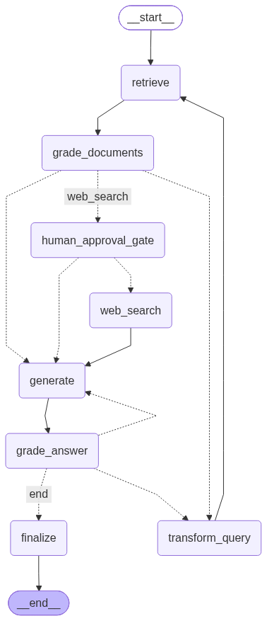

# Agentic RAG over Documents

A self-correcting **agentic RAG** system over documents, built on **LangGraph**.
Hybrid retrieval (dense + BM25 + RRF) → answer with verified citations, evolving
layer by layer into a graph that grades its own retrieval (**CRAG**) and its own
answers (**Self-RAG**), with memory, a human-approval gate before web search, and
a FastAPI + Docker deployment.

 This README tracks build
> status and how to run it.

## Build status

| Layer                                                                   | Tag                | Status                    |
| ----------------------------------------------------------------------- | ------------------ | ------------------------- |
| 1 — Baseline RAG (hybrid retrieve → generate w/ citations)              | `v0.1-baseline`    | **done**                  |
| 2 — CRAG (grade docs, conditional routing, transform_query, web_search) | `v0.2-crag`        | **done — verified live**  |
| 3 — Self-RAG (grade answer, regenerate/re-retrieve)                     | `v0.3-self-rag`    | **done — verified live**  |
| 4 — Memory + HITL (checkpointer + one interrupt gate)                   | `v0.4-memory-hitl` | not started               |
| 5 — Productionize (FastAPI, Docker, eval, LangSmith)                    | `v1.0`             | not started               |

Verification traces for each layer (real runs showing every router branch firing,
including a fault-injection test of the hallucination grader) live in
[`output documentation/`](<output documentation/>).

_(Per-layer eval comparison table goes here once the RAGAS harness runs — that's
the headline.)_

## Architecture (Layer 3 — CRAG + Self-RAG)



Two self-correction loops, one on each side of generation:

**CRAG — grade the retrieval (input side).** Every retrieved chunk is graded for
relevance by a structured-output LLM grader; only relevant chunks survive. If too
few survive, the graph rewrites the query and re-retrieves (capped at
`MAX_RETRIEVAL_LOOPS` cycles), then falls back to a Tavily web search as a last
resort. Web-sourced chunks are tagged `[web]` in the output.

**Self-RAG — grade the answer (output side).** No answer leaves the graph
unchecked. A hallucination grader verifies every claim is grounded in the
retrieved chunks; an answer grader then verifies it actually addresses the
question. Each failure routes to the stage that caused it: hallucination →
regenerate (capped at `MAX_GENERATION_LOOPS`); grounded-but-off-topic →
rewrite the query and re-retrieve (shared rewrite budget). An honest
"I don't know" from the generator is recognized and accepted, not looped on.
When a correction budget runs out, the best-effort answer is returned and
explicitly labeled unverified (`SELF-CHECK: best effort`) — the system fails
honestly instead of spinning or overclaiming.

Regenerate the diagram anytime with `python view_graph.py` (prints Mermaid
source and writes `graph.png`).

## Quickstart

```bash
# 1. Create a virtualenv and install deps
python -m venv agentic-rag && source agentic-rag/bin/activate

pip install -r requirements.txt

# 2. Add your key
cp .env.example .env        # set OPENAI_API_KEY and TAVILY_API_KEY (Layer 2)

# 3. Add a corpus  (see data/README.md for the suggested papers)
#    drop PDFs / markdown into ./data

# 4. Build the index, then ask
python main.py ingest
python main.py ask "What problem does Reciprocal Rank Fusion solve?"
```

Watch the trace lines to see the graph make decisions:
`--- GRADE: 4/5 chunks relevant ---`, `--- TRANSFORM (loop 1): ... ---`,
`--- GRADE ANSWER: grounded=yes, addresses-question=yes -> accept ---`, and the
final `=== SELF-CHECK ===` verdict on every answer.

## Layout

```
src/
  config.py      # all tunables (models, paths, chunking, retrieval k's, loop budgets)
  state.py       # the shared GraphState TypedDict
  ingestion.py   # load + chunk + persist Chroma
  retrieval.py   # dense + BM25 + RRF fusion
  nodes.py       # retrieve, generate + CRAG nodes + Self-RAG grade_answer + both routers
  graph.py       # the LangGraph StateGraph wiring
main.py          # CLI: ingest / ask
view_graph.py    # render the compiled graph (Mermaid + graph.png)
output documentation/  # per-layer verification traces (the evidence behind each tag)
eval/            # golden Q&A set + RAGAS harness (planned)
data/            # corpus (git-ignored)
```

## Stack

LangGraph · LangChain · OpenAI (GPT + `text-embedding-3-small`) · ChromaDB ·
BM25 (`rank_bm25`) · Tavily · RAGAS (eval) · FastAPI + Docker (Layer 5).
