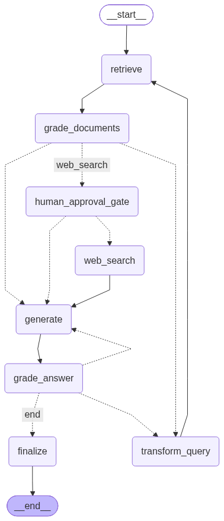

# Agentic RAG over Documents

A self-correcting **agentic RAG** system over documents, built on **LangGraph**.
Hybrid retrieval (dense + BM25 + RRF) → answer with verified citations, evolving
layer by layer into a graph that grades its own retrieval (**CRAG**) and its own
answers (**Self-RAG**), with memory, a human-approval gate before web search, and
a FastAPI + Docker deployment.

> This README tracks build status and how to run it.

## Build status

| Layer                                                                   | Tag                | Status                   |
| ----------------------------------------------------------------------- | ------------------ | ------------------------ |
| 1 — Baseline RAG (hybrid retrieve → generate w/ citations)              | `v0.1-baseline`    | **done**                 |
| 2 — CRAG (grade docs, conditional routing, transform_query, web_search) | `v0.2-crag`        | **done — verified live** |
| 3 — Self-RAG (grade answer, regenerate/re-retrieve)                     | `v0.3-self-rag`    | **done — verified live** |
| 4 — Memory + HITL (checkpointer + one interrupt gate)                   | `v0.4-memory-hitl` | **done — verified live** |
| 5 — Eval (RAGAS + golden set, caught a real data bug)                   | `v0.5-eval`        | **done**                 |
| 6 — API (FastAPI `/ask` + `/resume` + `/health`, 409 guards)            | `v0.6-api`         | **done**                 |
| 7 — Docker (Dockerfile + compose, seed-free clean clone)                | `v0.7-docker`      | **done — verified live** |

Remaining before `v1.0`: LangSmith tracing, and the walkthrough video.

Verification traces for each layer (real runs showing every router branch firing,
including a fault-injection test of the hallucination grader) live in
[`output documentation/`](<output documentation/>).

## Evaluation

One harness (`eval/run_eval.py`), one hand-written golden set
(`eval/golden_set.json`: 20 questions in five categories — `lookup`,
`multi_hop`, `no_answer`, `needs_web`, `known_failure` — each category built to
force one branch of the graph). Scoring is two-layer: **deterministic behavior
checks** (did it abstain / escalate to the approval gate / retrieve the expected
papers?) and **RAGAS quality metrics** (answer correctness, faithfulness,
context precision/recall). The HITL gate is auto-declined during eval;
`--approve-web` flips it. How-to and schema: [`eval/README.md`](eval/README.md);
the full story of the first runs: [`output documentation/layer5_eval_explained.md`](<output documentation/layer5_eval_explained.md>).

**The eval paid for itself on day one — it caught a silent data bug.** The
baseline run scored multi-hop questions 1/4 with suspiciously thin context.
Tracing showed `hybrid_retrieve` returning ~2 chunks instead of `TOP_K=6`; the
Chroma index turned out to hold 2,872 chunks — exactly **4 × 718**, because
`ingest` had been run four times and `Chroma.from_documents` _appends_. RRF's
dedup then collapsed the duplicate-heavy candidate lists, starving the
generator of context. Fix: `ingest` made idempotent, index rebuilt.

| run                        | behavior pass | context recall | context precision | faithfulness | answer correctness |
| -------------------------- | ------------- | -------------- | ----------------- | ------------ | ------------------ |
| `v0.4` (duplicated index)  | 15/20         | 0.765          | 0.697             | 0.941        | 0.657              |
| `v0.4-fixed` (clean index) | 15/20         | **0.856**      | **0.759**         | **0.972**    | 0.633              |
| `v0.5` (prompt fixes)      | _queued_      |                |                   |              |                    |

How to read it: the retrieval-side metrics moved exactly where a retrieval bug
should move them (multi-hop context recall 0.556 → 0.722), while LLM-judged
correctness shifts under 0.1 are judge noise, not signal. Behavior pass didn't
move — the same five questions fail in both runs, which is the more interesting
result: it isolates two **prompt-level** bugs from the **data-level** bug the
fix removed. (1) _Comparative questions_: the document grader rejects
single-paper chunks as irrelevant to a two-paper comparison — on "How does CRAG
differ from HyDE?" it rejected 18/18 retrieved chunks across three attempts.
(2) _Definitional over-abstention_: "How does HyDE retrieve documents…"
answered "I don't know" while holding 6/6 relevant chunks. Both fixes are
queued as the `v0.5` row.

```bash
python -m eval.run_eval --label v0.4 --skip-ragas   # fast behavior-only run
python -m eval.run_eval --label v0.4                # full run incl. RAGAS scores
```

## Architecture (Layer 4 — CRAG + Self-RAG + Memory + HITL)



Two self-correction loops, one on each side of generation:

**CRAG — grade the retrieval (input side).** Every retrieved chunk is graded for
relevance by a structured-output LLM grader; only relevant chunks survive. If too
few survive, the graph rewrites the query and re-retrieves (capped at
`MAX_RETRIEVAL_LOOPS` cycles), then falls back to a Tavily web search as a last
resort. Web-sourced chunks are tagged `[web]` in the output.

**Self-RAG — grade the answer (output side).** No answer leaves the graph
unchecked. A hallucination grader verifies every claim is grounded in the
retrieved chunks; an answer grader then verifies it actually addresses the
question. Each failure routes to the stage that caused it: hallucination →
regenerate (capped at `MAX_GENERATION_LOOPS`); grounded-but-off-topic →
rewrite the query and re-retrieve (shared rewrite budget). An honest
"I don't know" from the generator is recognized and accepted, not looped on.
When a correction budget runs out, the best-effort answer is returned and
explicitly labeled unverified (`SELF-CHECK: best effort`) — the system fails
honestly instead of spinning or overclaiming.

**Memory — checkpointed, multi-turn threads.** The graph compiles with a SQLite
checkpointer, so every conversation is a persistent thread: follow-up questions
see the history, and the same `thread_id` picks a conversation back up even
after a process restart. The accepted answer is appended to the history _inside_
the graph (a terminal `finalize` node), so the memory write shares the turn's
checkpoint. Correction budgets are turn-scoped and reset on every question —
one budget-exhausting turn can't disable the corrective loops for the rest of
the thread.

**HITL — one approval gate, on the highest-stakes action.** The only point where
the graph reaches outside the document corpus is the web-search fallback, so
that single edge gets a human gate: the graph pauses via LangGraph's
`interrupt()`, shows the query it wants to search, and waits for y/n. Approval
proceeds to Tavily; denial routes to a best-effort answer from whatever weak
documents survived grading — which the generator's abstention rule keeps honest
(typically an explicit "I don't know" rather than a fabricated answer).
Unrecognized input fails closed (denied).

Regenerate the diagram anytime with `python view_graph.py` (prints Mermaid
source and writes `graph.png`).

## Quickstart

Docker is the intended path — nothing to install but Docker itself, and the
corpus seeds itself (see [Corpus](#corpus) below).

```bash
# 1. Add your key(s)
cp .env.example .env        # set OPENAI_API_KEY (+ TAVILY_API_KEY for the web-search fallback)

# 2. One-time on a fresh clone: these three files must exist as *files* before
#    the first run, or Docker bind-mounts a directory in their place instead
#    (breaks SQLite). Not needed on repeat runs.
touch checkpoint.db checkpoint.db-wal checkpoint.db-shm

# 3. Build the index — fetches the locked 8-paper corpus from arXiv automatically
docker-compose run --rm api python main.py ingest

# 4. Serve the API
docker-compose up -d
```

Swagger UI is at `http://localhost:8000/docs`. `POST /ask` with
`{"thread_id": "demo", "question": "..."}`; if the graph wants to fall back to
a web search it returns `status: "needs_approval"` instead of an answer — call
`POST /resume` with `{"thread_id": "demo", "approved": true}` to decide it.
`GET /health` is what the Dockerfile's `HEALTHCHECK` polls.

### Run locally instead (interactive CLI, no Docker)

```bash
python -m venv agentic-rag && source agentic-rag/bin/activate
pip install -r requirements.txt

cp .env.example .env        # set OPENAI_API_KEY (+ TAVILY_API_KEY)

python main.py ingest         # fetches the corpus automatically, same as above
python main.py ask            # interactive session on thread "default"
python main.py ask demo       # ...or name a thread; same id resumes it later
```

Questions are typed at the interactive prompt. Conversations are checkpointed
to `checkpoint.db` per thread — quit, restart, `ask demo` again, and the thread
remembers.

Watch the trace lines to see the graph make decisions:
`--- GRADE: 4/5 chunks relevant ---`, `--- TRANSFORM (loop 1): ... ---`,
`--- GRADE ANSWER: grounded=yes, addresses-question=yes -> accept ---`, the
`[APPROVAL NEEDED]` pause when the graph wants to leave the corpus, and the
final `=== SELF-CHECK ===` verdict on every answer.

### Corpus

The 8 foundational papers (see [`data/README.md`](data/README.md) for the
list) are **not** committed to git and **not** baked into the Docker image —
`ingest`'s `fetch_corpus()` step downloads them straight from arXiv by their
pinned IDs the first time it runs against an empty `data/`. Drop your own
files into `data/` beforehand if you want a different/custom corpus instead —
`fetch_corpus()` only fetches the default set when `data/` is completely
empty, so it never silently tops up a hand-curated one.

## Layout

```
src/
  config.py      # all tunables (models, paths, chunking, retrieval k's, loop budgets)
  state.py       # the shared GraphState TypedDict
  ingestion.py   # fetch_corpus + load + chunk + persist Chroma (idempotent: resets the index first)
  retrieval.py   # dense + BM25 + RRF fusion
  nodes.py       # retrieve, generate, CRAG + Self-RAG graders, HITL gate, all routers
  graph.py       # the LangGraph StateGraph wiring (compiled with a checkpointer)
main.py          # CLI: ingest / ask (interactive, thread-scoped, handles the HITL pause)
app.py           # FastAPI service: /ask, /resume, /health (Layer 6)
Dockerfile       # python:3.11-slim, 0.0.0.0 bind, HEALTHCHECK against /health (Layer 7)
docker-compose.yml  # the api service: build, ports, env_file, state volumes
view_graph.py    # render the compiled graph (Mermaid + graph.png)
output documentation/  # per-layer verification traces (the evidence behind each tag)
eval/            # golden Q&A set + harness + results (see eval/README.md)
data/            # corpus — git-ignored, seeded by fetch_corpus() on a clean clone
checkpoint.db    # SQLite conversation memory (git-ignored)
```

## Stack

LangGraph · LangChain · OpenAI (GPT + `text-embedding-3-small`) · ChromaDB ·
BM25 (`rank_bm25`) · Tavily · RAGAS (eval, Layer 5) · FastAPI (Layer 6) ·
Docker + docker-compose (Layer 7).
